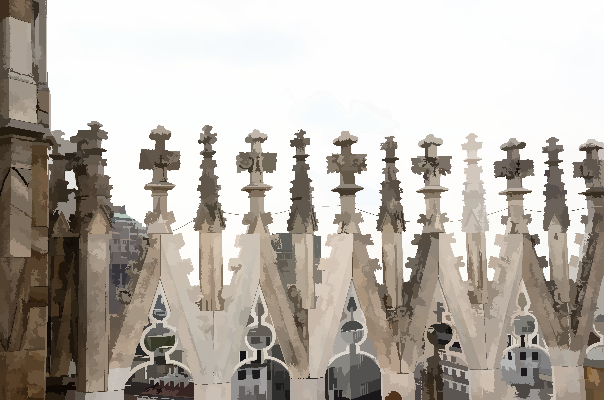
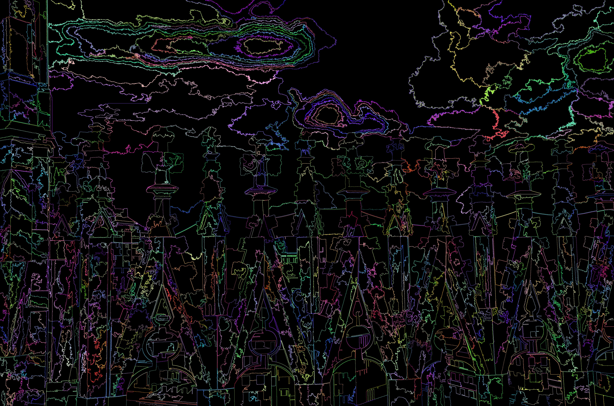

# Some experiments with Image processing

## Introduction

This repository contains some older C++ projects of mine that I worked on quite some time ago (around about C++11 being standardized). I think they may have some elements of interest to others and they provided me with an opportunity to play with some C++20 features to brush up on all the changes that have happened in C++ over the years.

## Downloading and Building

The project uses Visual Studio 2022 Community edition as build environment and currently runs only on Windows, since it uses GDIPLUS for basic image file (TIF/PNG/BMP/PNM) loading and saving. It could easily be made more cross platform with some other image decoding library. For faster matrix support than my original hand rolled code I have added [Eigen](https://eigen.tuxfamily.org/index.php?title=Main_Page) as a GIT submodule.

To clone the code use:

```git clone --recurse-submodules https://github.com/mnesbit/ImageExperiments.git```

Then just load the ImageExperiments.sln into visual studio.

## Data used for calibration
To get hold of uncompressed images for calibration and test I used the files from the [RAISE project](http://loki.disi.unitn.it/RAISE/download.html) that had only lossless TIF compression applied.

## Sub project descriptions

### OrthogonalMatchingPursuit

In this project I was originally experimenting with [Orthogonal Matching Pursuit](https://en.wikipedia.org/wiki/Matching_pursuit) and sparse over complete dictionary coding of images.

While doing this I created a simple dictionary of basis vectors using image patches partitioned by a single line cut and set to +1.0 on one side and -1.0 on the other. After normalization of these basis vectors I then applied them to images. I was quite impressed by the results which capture the broad structure of the images quickly and give nice clean edges with a slightly painting like quality. (Perhaps useful for image denoising, but I haven't explored this). The basis set couldn't include any texture detail effectively, but set me thinking about ways to reduce the Gibbs phenomena artefacts seen in DCT coding.

This sent me down a route where I looked into providing smooth basis vectors for each segmented portion using the [KLT](https://en.wikipedia.org/wiki/Kosambi%E2%80%93Karhunen%E2%80%93Lo%C3%A8ve_theorem) generated from a model of the pixel wise distance correlation function. This being based upon the fact that the DCT commonly used in lossy image compression is closely related to the KLT of a simple Markov process. The result was interesting enough that I thought I should progress this to see if there was any value in it for image compression.

Example
Original JPEG colour image


Mono image using first 8 segmented basis


Mono image using first 8 segmented plus KLT basis


### Compression

This is the full worked compression algorithm, where I have applied quantized matching pursuit to the full colour image input. The basis set starting with the plain segment one (including a DC one) and then pulling in the KLT over the respective segments to allow refinement of texture. The resulting quantized coefficients are then entropy coded ([Zig-Zag](https://en.wikipedia.org/wiki/Variable-length_	quantity#Zigzag_encoding) coded into positive 16-bit integers and then [Canonical Huffman](https://en.wikipedia.org/wiki/Canonical_Huffman_code), or [Rice-Golomb](https://en.wikipedia.org/wiki/Golomb_coding) according to what gets the best compression ratio).

The end result is quite comparable to JPEG, but the additional cost of specifying the dictionary elements takes up slightly more space than the reduction offered by the faster convergence of the coefficient. A shame it didn't work in the end, but it was fun to play with.

Example
Original from RAISE data set


Compressed at quality 3.5 using algorithm and then converted back to PNG compressed size 3.52 MB (3,698,188 bytes)


JPEG compressed size 3.85 MB (4,041,049 bytes)


### Segmentation

This is another of my older projects that extends upon ideas and code from [Efficient Graph-Based Image Segmentation](https://cs.brown.edu/people/pfelzens/papers/seg-ijcv.pdf) by Pedro Felzenszwalb. I took the basic [code](https://cs.brown.edu/people/pfelzens/segment/segment.zip) ideas from a repository on their [academic pages](https://cs.brown.edu/people/pfelzens/segment/).

The basic algorithm starts with every pixel in its own cluster and then merges them based upon colour similarity. On analysis I found that the original algorithm had problems in early phases with merging across edges. I was able to improve this considerably by adding a scaled gradient value (using the differentiator filter from *Farid, H., & Simoncelli, E. P. (2004). Differentiation of discrete multidimensional signals. IEEE Transactions on image processing, 13(4), 496-508*) In early phases this prevents joins across edges, but is outweighed by patch colour differences in later phases. Additionally by marking patches that have had at least one merge already I prevent runaway merging that keeps the clusters more similarly sized and give better results. The algorithm is a bit sensitive to the sort order and so is a bit randomised based on minor differences in the calculated weights. The algorithm doesn't handle fine textures as a single item, and although I have had some success with adding DCT coefficients to the algorithm it is very hard to match it to the other weight elements, so this version is just the simple segmentation algorithm.

Example

Original from RAISE data set


Segmented for 7 rounds and showing average colours


Segmented for 7 rounds and showing segment boundaries


### CalculateImageCovar

This project is used to scan over a folder of images and generate a pixel covariance matrix from randomly sampled patches. The committed version only calculates for Y components, but can be trivially modified to calculate other data.

### FitCovarianceModel

This project takes a covariance matrix generated by the CalculateImageCovar project and uses a [Particle Swarm Algorithm](https://en.wikipedia.org/wiki/Particle_swarm_optimization) to least squares fit a parametrised model to it. The distance model is then used when generating the KLT basis sets used in the Compression project.

### ImageHelper

A simple library for image loading, saving and pixel manipulation. Originally it came from the Pedro Felzenszwalb mentioned above, but it has been extended using GDIPLUS image functions.

### SimpleMatrix

A plain matrix maths library to enable simple experimentation, without all the complications of a third part library.

### CompressionLib

The routines used in Compression project for generating the basis vector dictionaries, carrying out quantized matching pursuit, writing and reading bitstreams and entropy coding the bitstreams.

### Testing

A Google.Test project to test the more fiddly bits of the bitstream and entropy coding functions.

### Data

Some captured data used in calibrating the models and choosing the quantization bit allocation schedule.

### eigen

The submodule folder for the eigen matrix library.


